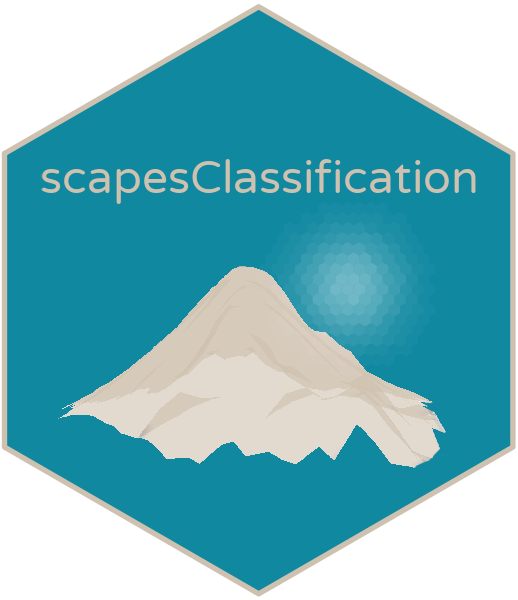

<!-- README.md is generated from README.Rmd. Please edit that file -->

```{r, include = FALSE}
knitr::opts_chunk$set(
  collapse = TRUE,
  comment = "#>",
  fig.path = "man/figures/README-",
  out.width = "100%"
)
```

# scapesClassification 

The R-package `scapesClassification` is designed to translate users' mental models of seascapes, landscapes and, more generally, of geo-spaces into computer representations (classifications). Spaces and geographic objects are classified with user-defined rules taking into account spatial data as well as spatial relationships among different classes and objects.

## Raster surfaces and objects
* (scapes)Classifications are performed on raster surfaces. The suit of available functions can be used to segment the raster space and to identify distinct raster objects (i.e., distinct groups of raster cells, each having a unique ID).

## Key ideas
* Landscapes and seascapes tend to have prominent features easy to identify. These features can be associated to a group of raster cells (**anchor cells**) and can be used to initialize a classification process;

* Classification rules can take into account spatial relationships, i.e., where a segment of space or an object is expected to be in relation to anchor cells or to other objects; 

* Classification rules can also take into account multi-layer gridded data; objects and segments can be defined based on a combination of data-driven rules and spatial relationships. 

## Installation

You can install the released version of `scapesClassification` from [CRAN](https://CRAN.R-project.org) with:

``` r
install.packages("scapesClassification", dependencies = TRUE)
```

And the development version from [GitHub](https://github.com/ghTaranto/scapesClassification) with:

``` r
# install.packages("devtools")
devtools::install_github("ghTaranto/scapesClassification", dependencies = TRUE)
```

## Usage and documentation 

A general overview of the package is available in [Github Pages](https://ghtaranto.github.io/scapesClassification/index.html): 

* Implementation

* [Working example](file:///E:/Documents/GeraldTaranto/Phd/ATLAS/Reports_Papers/GMU/Rcodes/Git/scapesClassification/docs/articles/scapesClassification_02_0_GMU.html)

* [Functions](https://ghtaranto.github.io/scapesClassification/reference/index.html)
