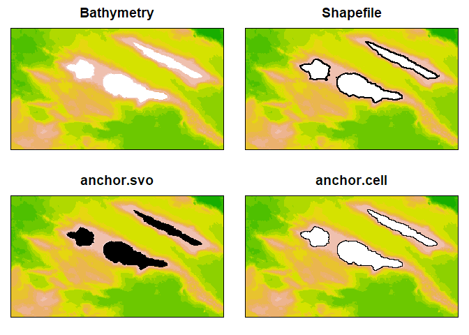
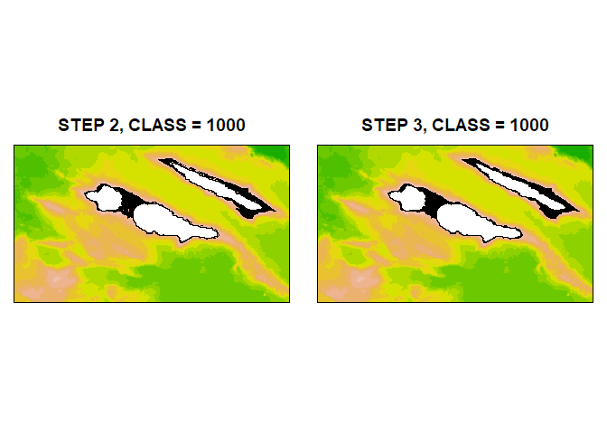

<!-- README.md is generated from README.Rmd. Please edit that file -->

# scapesClassification

<!-- badges: start -->

<!-- badges: end -->

Classification of seascapes or landscapes using environmental and
geographic data stored as `Raster*` objects. The classification is
implemented using a stepwise procedure. At each step a portion of the
“scape” is classified based on user defined conditions, local spatial
statistics and/or spatial contiguity between classes. The portion of
“scape” classified can be considered in the next classification step.
User defined conditions can be absolute, relative to the focal cell or
relative to the focal neighbourhood.

## Installation

You can install the released version of scapesClassification from
[CRAN](https://CRAN.R-project.org) with:

``` r
install.packages("scapesClassification", dependencies = TRUE)
```

And the development version from [GitHub](https://github.com/) with:

``` r
# install.packages("devtools")
devtools::install_github("ghTaranto/scapesClassification", dependencies = TRUE)
```

## Why `scapesClassification`?

`scapesClassification` can be used in any situation where we need to
classify seascapes or landscapes based on a set of conditions that
consider class contiguity and environmental or geographic data stored as
`Raster*` objects.

For instance, let’s imagine we want to evaluate the potential spillover
of an animal population from a reserve (i.e. the capacity of a
population resident in a protected area to reach and colonize
unprotected areas). If we know some of the abiotic and biotic
characteristics of its habitat, we could estimate the potential
spillover as the amount of area adjacent to the reserve that meets the
species’ habitat requirements. The first step would be to identify
raster cells adjacent to the reserve having suitable habitat. We will
call this type of cells `spillOver_Cell`. However, we can also suppose
that once an animal reaches these cells, he could move further away from
the reserve to other contiguous suitable cells. For simplicity, imagine
that a cell is suitable if `var_x >= value_y`. We can then solve our
problem identifying all cells meeting the following conditions:

> **IF**
> 
> `C` *is neighbour of* `reserve_Cell`
> 
> **OR**
> 
> `C` *is neighbour of* `spillOver_Cells`
> 
> **AND**
> 
> `var_x >= value_y`
> 
> **THEN**
> 
> `C` *is* `spillOver_Cells`

In this case the classification process is iterative and depends on
previous classification steps. In fact, as long as new cells are
classified as `spillOver_Cells`, we will need to evaluate whether new
contiguous cells meet our conditions or not.

We could also define this classification problem in more complex terms.
For instance by considering areas with sub-optimal conditions as
transition zones and areas adjacent to these transition zones showing
improved habitat conditions as connected suitable areas. At the same
time we could decide not to consider as suitable any cell adjacent to
highways or urban areas and so on.

`scapesClassification` represent a powerful tool to solve complex
classification problems using class contiguity (or discontinuity), user
defined conditions and any number of environmental and geographic
variables.

## Implementation

`scapesClassification` uses environmental and geographic raster to solve
classification problems. Besides being thought of as a matrix, raster
data can be thought of as a vector indexed by cell numbers
([RSpatial](https://rspatial.org/raster/pkg/8-cell_level_functions.html?highlight=cell%20number)).
Functions in the `scapesClassification` package rely on cell numbers to
evaluate local conditions and spatial adjacency.

### 1.Format inputs

In the first step the `Raster*` object is converted into an attribute
table (`data.frame`). The first column of the attribute table, named
`Cell`, refers to positions on the `Raster*` object. The attribute table
includes **only complete cases**, i.e., raster cells having a value for
every layer in the stack.

In the second step, we identify the `list` of 8-neighbors ([Moore
neighborhood](https://en.wikipedia.org/wiki/Moore_neighborhood)) of
every cell in the attribute table. This list allows for a fast
evaluation of local and class contiguity conditions.

**Functions:** `?attTbl` and `?ngbList`.

### 2.Set anchor cells

Anchor cells can be thought of as raster cells having particular
characteristics from where the classification process can start. Anchor
cells can be derived by: previous classifications (e.g., reserve cells),
environmental or geographic characteristics (e.g., flat areas), local
maxima or minima (e.g., local peaks on a mountain ridge) or spatial
vector objects (e.g., shapefiles).

**Functions:** `?anchor.cell`, `?anchor.seed`, `?anchor.svo` and
`?cond.4.all`.

### 3.Classify raster cells

Once anchor cells are defined, we can proceed with our classification
considering *class contiguity* and a combination of *absolute*, *focal
cell*, *focal neighborhood* and *directional neighborhood* conditions.
Conditions are passed to scapesClassification functions as a single
**`character string`**. They can consist of combination of arithmetic
(`+|-|*|/|^|%%|%/%`), relational (`>|<|>=|<=|==|!=|%/%`) and logic
operators (`&||`), base R functions (e.g., `abs(variable_name)`),
variables names (i.e., `names(attTbl)`) and previous classifications
(referred to and stored as `"classVector"`). (see `?contitions`).

  - **Class contiguity.** Defines the sets of cells for which we want to
    evaluate our conditions. When it is not considered all cells that
    have not yet been classified are evaluated. When it is considered
    only cells that have not yet been classified AND that are adjacent
    (or not adjacent) to a specific group of classes are evaluated. In
    the latter case, both absolute and relative conditions can be used.
    Their evaluation is iterative. At each iteration, conditions are
    evaluated for the 8-neighbors (`nbs`) adjacent to a `focal` cell
    belonging to one of the classes of interest.

  - **Absolute conditions.** Absolute conditions compare between the
    cell in evaluation and user defined numeric values.

  - **Relative conditions.** Relative conditions compare between the
    cell in evaluation and its neighbors.
    
      - **Focal cell conditions.** Focal cell conditions compare between
        the values stored in `nbs` cells with the value stored in the
        `focal` cell.
    
      - **Focal neighborhood conditions.** Focal neighborhood conditions
        compare between values stored in `nbs` cells with values stored
        in their neighbors (`nofn`).
    
      - **Directional neighborhood conditions.** Directional
        neighborhood conditions are similar to focal neighborhood
        conditions, however `nofn` are determined differently. For each
        `nbs` in evaluation, `nofn` are determined as the shared
        neighbors between the `focal` cell and the `nbs` cell.

**Functions:** `"?conditions"`, `"?cond.4.all"`, `"?cond.4.nofn"`,
`"?cond.reclass"`, `"?classify.all"`, `"?reclass.nbs"`.

## Geomorphic Management Units

The following is an example using `scapesClassification` to classify
marine seafloor structures, hereinafter referred to as geomorphic
management units (GMUs). Our study area is located in the ‘Triangle’ of
the Azores (NE Atlantic), around the islands of Faial, Pico and São
Jorge. In order to identify relevant GMUs, we will use a `RasterStack`
of four layers, including bathymetry and bathymetric derivatives
(e.g. see [Walbridge et
al., 2018](https://www.mdpi.com/2076-3263/8/3/94/htm) as a reference for
benthic derivatives):

  - Bathymetry: depth values;
  - Local benthic position index: useful to identify the limits of
    different GMUs;
  - Regional benthic position index: useful to identify GMUs relevant at
    regional scales;
  - Slope: useful to identify areas with distinct ecological settings.

We will use the package `rasterVis` for plotting our results.

We can load the `RasterStack` and create the attribute table and the
8-neighbors list with the following code:

``` r
# LOAD LIBRARIES
library(raster)
library(sp)
library(rgdal)
library(scapesClassification)

# FOR PLOTTING
library(rasterVis)
library(gridExtra)
library(latticeExtra)

# READ RASTER STACK
grd <- list.files(system.file("extdata", package = "scapesClassification"), full.names = T)
grd <- grd[grep("\\.grd", grd)]
rstack <- raster::stack(grd)

# ATTRIBUTE TABLE
dt <- attTbl(rstack, var_names = c("bathymetry", "local_bpi", "regional_bpi", "slope"))

# 8-neighbors list
nbs <- ngbList(rstack)

# PLOT
p1 <- rasterVis::levelplot(rstack[[1]], col.regions = terrain.colors(255), margin = F, main = "Bathymetry")
p2 <- rasterVis::levelplot(rstack[[2]], col.regions = terrain.colors(255), margin = F, main = "Local BPI")
p3 <- rasterVis::levelplot(rstack[[3]], col.regions = terrain.colors(255), margin = F, main = "Regional BPI")
p4 <- rasterVis::levelplot(rstack[[4]], col.regions = terrain.colors(255), margin = F, main = "Slopes")

gridExtra::grid.arrange(p1, p2, p3, p4, nrow=2)
```


### Island Shelf Units

**Step 1**

In order to start our GMUs classification, we can consider **island
shelf units (ISUs)**. ISUs comprise two main elements: (i) island
shelves (i.e. relatively flat areas surrounding islands) and (ii) slopes
that connect island shelves with the seafloor. We will classify island
shelves with the numeric value `1000` and island slopes with the numeric
value `1100`.

By definition, it is possible to consider all cells adjacent to
landmasses as island shelves. We can use (i) a shapefile to determine
where the islands are located, (ii) the function `anchor.svo` to extract
anchor cells from spatial vector objects and (iii) the function
`anchor.cell` to perform the first step of our classification by
classifying all cells adjacent to landmasses as island shelves:

``` r
# READ SHAPEFILE
shp <- system.file("extdata", "Azores.shp", package = "scapesClassification")

island <- rgdal::readOGR(dsn = shp, verbose = F)
island <- sp::spTransform(island, raster::crs(rstack))

## ANCHOR POINTS FROM LAND POSITION
anchorL <- anchor.svo (rstack = rstack, 
                       spatial_vector_name = shp, 
                       only_NAs = TRUE, 
                       fill_NAs = TRUE, 
                       plot = FALSE)

## SET CELLS ADJACENT TO LAND ANCHOR POINTS AS ISLAND SHELVES (class = 1000)
classVector <- anchor.cell(dt, 
                           rstack, 
                           anchor      = anchorL, 
                           class       = 1000,
                           classVector = NULL,
                           class2cell  = FALSE,
                           class2nbs   = TRUE,
                           plot        = FALSE)

## INCLUDE ANCHOR POINTS and classVector IN A RASTER FOR PLOTTING
rL   <- rstack[[1]]; rL[]  <- NA; rL[anchorL]  <- 1
rAC  <- rstack[[1]]; rAC[] <- NA; rAC[dt$Cell] <- classVector

## PLOT RESULTS
p1 <- rasterVis::levelplot(rstack[[1]], col.regions = terrain.colors(255), margin = F, main = "Bathymetry", colorkey = FALSE, scales=list(draw=FALSE))
p2 <- rasterVis::levelplot(rstack[[1]], col.regions = terrain.colors(255), margin = F, main = "Shapefile", colorkey = FALSE, scales=list(draw=FALSE)) + 
  latticeExtra::layer({
    
    island <- system.file("extdata", "Azores.shp", package = "scapesClassification")
    island <- rgdal::readOGR(dsn = island, verbose = F)
    island <- sp::spTransform(island, "+proj=utm +zone=26 +datum=WGS84 +units=m +no_defs")
    sp.polygons(island, lwd = 2)
    
    })

p3 <- rasterVis::levelplot(rstack[[1]], col.regions = terrain.colors(255), margin = F, main = "anchor.svo", colorkey = FALSE, scales=list(draw=FALSE)) + 
  rasterVis::levelplot(rL, col.regions = "black", colorkey = FALSE)
p4 <- rasterVis::levelplot(rstack[[1]], col.regions = terrain.colors(255), margin = F, main = "anchor.cell", colorkey = FALSE, scales=list(draw=FALSE)) + 
  rasterVis::levelplot(rAC, col.regions = "black", colorkey = FALSE)

gridExtra::grid.arrange(p1, p2, p3, p4, nrow=2)
```



  - **`?anchor.svo`** arguments:
      - `only_NAs` determines the function to return only cell numbers
        overlapping with the spatial vector data that have missing
        values in rstack.
      - `fill_NAs` determines the function to return cell numbers of
        cells adjacent to those overlapping with the spatial vector data
        that have missing values in rstack.
  - **`?anchor.cell`** arguments:
      - `class2nbs` attribute the new classification, defined by the
        argument `class`, to the cells adjacent to anchor cells.

The classification of the first step is returned as a class vector
(`classVector`). All class vectors can be indexed back into the original
raster considering the the cell numbers stored in the attribute table,
column `Cell`. In this example we can use the following code:

``` r
## CREATE AN EMPTY RASTER WITH THE SAME PROPERTIES AS THE ORIGINAL RASTER STACK
# r2   <- rstack[[1]]
# r2[] <- NA

## INDEX THE CLASS VECTOR INTO THE RASTER
# r2[dt$Cell] <- classVector

## PLOT OR SAVE RESULTS
# raster::plot(r2)
# raster::writeRaster(r2, "step01_ISU.tif")

# IN ALTERNATIVE USE ?cv.2.rast FUNCTION
# cv.2.rast(rstack, dt$Cell, classVector, writeRaster = "step01_ISU.tif")
```

**Steps 2 and 3**

In the second step we define that all cells adjacent to island shelf
cells having a moderate slope will be considered, as well, as island
shelf. Note that we want to push this classification to all cells
neighboring newly classified cells (neighbors of neighbors or `nofn`)
that respect our conditions. We can do so using the function
`?cond.4.nofn` to classify all neighbors and `nofn` of island shelf
cells (`nbs_of = 1000`) as island shelf (`class = 1000`) if they have a
moderate slope (`conditions = "slope <= 5"`).

Additionally, we can consider that if a cell is surrounded by at least 5
cells classified as island shelf, then it can also be classified as
island shelf. Again we use the function `?cond.4.nofn`, but this time we
set the argument `min.border = 0.6` (i.e., at least 60% of the 8 cells
neighboring the cell in evaluation have to be classified as island
shelves, `class = 1000`).

``` r
# STEP 2, ISU_1000
classVector2 <- cond.4.nofn(dt, nbs, 
                            classVector, 
                            nbs_of = 1000, 
                            conditions = "slope <= 5", 
                            class = 1000)

# STEP 3, ISU_1000
classVector3 <- cond.4.nofn(dt, nbs, 
                            classVector2, 
                            nbs_of = 1000, 
                            conditions = "TRUE", 
                            class = 1000,
                            min.border = 0.6)

## INCLUDE classVector IN A RASTER FOR PLOTTING
r2 <- rstack[[1]]; r2[] <- NA; r2[dt$Cell] <- classVector2
r3 <- rstack[[1]]; r3[] <- NA; r3[dt$Cell] <- classVector3

## PLOT RESULTS
p1 <- rasterVis::levelplot(rstack[[1]], col.regions = terrain.colors(255), margin = F, main = "STEP 2, CLASS = 1000", colorkey = FALSE, scales=list(draw=FALSE)) + 
  rasterVis::levelplot(r2, col.regions = "black", colorkey = FALSE)

p2 <- rasterVis::levelplot(rstack[[1]], col.regions = terrain.colors(255), margin = F, main = "STEP 3, CLASS = 1000", colorkey = FALSE, scales=list(draw=FALSE)) + 
  rasterVis::levelplot(r3, col.regions = "black", colorkey = FALSE)

gridExtra::grid.arrange(p1, p2, ncol=2)
```



**Note** that at each step our `classVector` is updated, i.e., only
cells that have not been yet classified in previous steps
(`dt$Cell[which(is.na(classVector))]`) are considered for
classification.

**Steps 3 and 4**

Next, we will define island slopes (`class = 1100`). Island slopes are
contiguous to island shelf cells and to island slopes cells (`nbs_of =
c(1000, 1100)`). In step 3 we consider that all slopes on island shelf
units are elevated with respect to the seafloor. We can use the variable
`regional_bpi` to define this condition (positive values indicate cells
on regional elevations). Moreover, we want to classify a cell as island
slope only if its neighborhood is also elevated with respect to the
seafloor. Let us consider a cell that was classified as island shelf and
refer to it as `focal` cell and one of its neighboring cells in
evaluation as `nbs`. We can then consider all the shared neighbors
between the `focal` and the `nbs` cell to evaluate our condition. In
this case we could consider that all shared neighbors must have a
`regional_bpi > 100` in order to classify `nbs` as island slope. This
type of condition is a *directional neighborhood condition* and in
`scapesClassification` is flagged by a variable name followed by `{}`
(`conditions = "regional_bpi{} > 100"`; see `?conditions` for more
information). Instead of considering that all shared neighbors have to
respect our condition to proceed with the classification, we can
consider that the classification proceed if a percentace of shared neig
