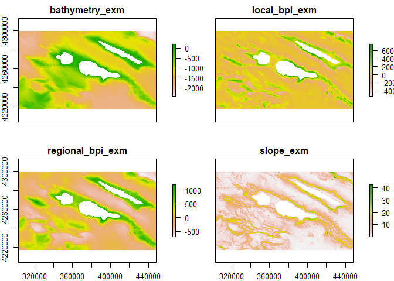
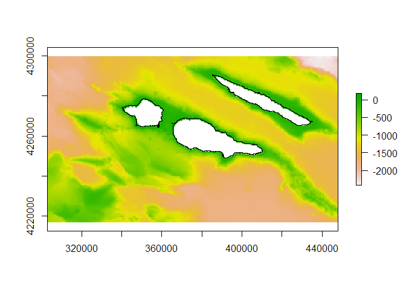
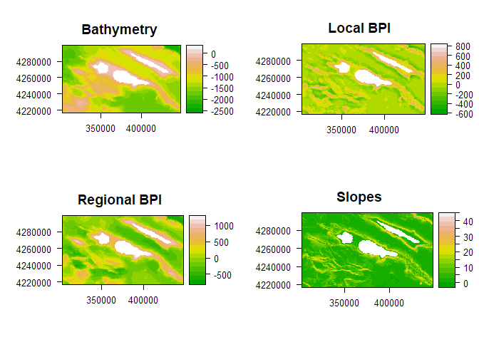

<!-- README.md is generated from README.Rmd. Please edit that file -->

# scapesClassification

<!-- badges: start -->

<!-- badges: end -->

Classification of seascapes or landscapes using environmental and
geographic data stored as `Raster*` objects. The classification is
implemented using a stepwise procedure. At each step a portion of the
“scape” is classified based on user defined conditions, local spatial
statistics and/or spatial contiguity between classes. The portion of
“scape” classified can be considered in the next classification step.
User defined conditions can be absolute, relative to the focal cell or
relative to the focal neighbourhood.

## Installation

You can install the released version of scapesClassification from
[CRAN](https://CRAN.R-project.org) with:

``` r
install.packages("scapesClassification", dependencies = TRUE)
```

And the development version from [GitHub](https://github.com/) with:

``` r
# install.packages("devtools")
devtools::install_github("ghTaranto/scapesClassification", dependencies = TRUE)
```

## Why `scapesClassification`?

`scapesClassification` can be used in any situation where we need to
classify seascapes or landscapes based on a set of conditions that
consider class contiguity and environmental or geographic data stored as
`Raster*` objects.

For instance, let’s imagine we want to evaluate the potential spillover
of an animal population from a reserve (i.e. the capacity of a
population resident in a protected area to reach and colonize
unprotected areas). If we know some of the abiotic and biotic
characteristics of its habitat, we could estimate the potential
spillover as the amount of area adjacent to the reserve that meets the
species’ habitat requirements. The first step would be to identify
raster cells adjacent to the reserve having suitable habitat. We will
call this type of cells `spillOver_Cell`. However, we can also suppose
that once an animal reaches these cells, he could move further away from
the reserve to other contiguous suitable cells. For simplicity, imagine
that a cell is suitable if `var_x >= value_y`. We can then solve our
problem identifying all cells meeting the following conditions:

> **IF**
> 
> `C` *is neighbour of* `reserve_Cell`
> 
> **OR**
> 
> `C` *is neighbour of* `spillOver_Cells`
> 
> **AND**
> 
> `var_x >= value_y`
> 
> **THEN**
> 
> `C` *is* `spillOver_Cells`

In this case the classification process is iterative and depends on
previous classification steps. In fact, as long as new cells are
classified as `spillOver_Cells`, we will need to evaluate whether new
contiguous cells meet our conditions or not.

We could also define this classification problem in more complex terms.
For instance by considering areas with sub-optimal conditions as
transition zones and areas adjacent to these transition zones showing
improved habitat conditions as connected suitable areas. At the same
time we could decide not to consider as suitable any cell adjacent to
highways or urban areas and so on.

`scapesClassification` represent a powerful tool to solve complex
classification problems using class contiguity (or discontinuity), user
defined conditions and any number of environmental and geographic
variables.

## Implementation

`scapesClassification` uses environmental and geographic raster to solve
classification problems. Besides being thought of as a matrix, raster
data can be thought of as a vector indexed by cell numbers
([RSpatial](https://rspatial.org/raster/pkg/8-cell_level_functions.html?highlight=cell%20number)).
Functions in the `scapesClassification` package rely on cell numbers to
evaluate local conditions and spatial adjacency.

### 1.Format inputs

In the first step the `Raster*` object is converted into an attribute
table (`data.frame`). The first column of the attribute table, named
`Cell`, refers to positions on the `Raster*` object. The attribute table
includes **only complete cases**, i.e., raster cells having a value for
every layer in the stack.

In the second step, we identify the `list` of 8-neighbors ([Moore
neighborhood](https://en.wikipedia.org/wiki/Moore_neighborhood)) of
every cell in the attribute table. This list allows for a fast
evaluation of local and class contiguity conditions.

**Functions:** `?attTbl` and `?ngbList`.

### 2.Set anchor cells

Anchor cells can be thought of as raster cells having particular
characteristics from where the classification process can start. Anchor
cells can be derived by: previous classifications (e.g., reserve cells),
environmental or geographic characteristics (e.g., flat areas), local
maxima or minima (e.g., local peaks on a mountain ridge) or spatial
vector objects (e.g., shapefiles).

**Functions:** `?anchor.cell`, `?anchor.seed`, `?anchor.svo` and
`?cond.4.all`.

### 3.Classify raster cells

Once anchor cells are defined, we can proceed with our classification
considering *class contiguity* and a combination of *absolute*, *focal
cell*, *focal neighborhood* and *directional neighborhood* conditions.
Conditions are passed to scapesClassification functions as a single
**`character string`**. They can consist of combination of arithmetic
(`+|-|*|/|^|%%|%/%`), relational (`>|<|>=|<=|==|!=|%/%`) and logic
operators (`&||`), base R functions (e.g., `abs(variable_name)`),
variables names (i.e., `names(attTbl)`) and previous classifications
(referred to and stored as `"classVector"`). (see `?contitions`).

  - **Class contiguity.** Defines the sets of cells for which we want to
    evaluate our conditions. When it is not considered all cells that
    have not yet been classified are evaluated. When it is considered
    only cells that have not yet been classified AND that are adjacent
    (or not adjacent) to a specific group of classes are evaluated. In
    the latter case, both absolute and relative conditions can be used.
    Their evaluation is iterative. At each iteration, conditions are
    evaluated for the 8-neighbors (`nbs`) adjacent to a `focal` cell
    belonging to one of the classes of interest.

  - **Absolute conditions.** Absolute conditions compare between the
    cell in evaluation and user defined numeric values.

  - **Relative conditions.** Relative conditions compare between the
    cell in evaluation and its neighbors.
    
      - **Focal cell conditions.** Focal cell conditions compare between
        the values stored in `nbs` cells with the value stored in the
        `focal` cell.
    
      - **Focal neighborhood conditions.** Focal neighborhood conditions
        compare between values stored in `nbs` cells with values stored
        in their neighbors (`nofn`).
    
      - **Directional neighborhood conditions.** Directional
        neighborhood conditions are similar to focal neighborhood
        conditions, however `nofn` are determined differently. For each
        `nbs` in evaluation, `nofn` are determined as the shared
        neighbors between the `focal` cell and the `nbs` cell.

**Functions:** `"?conditions"`, `"?cond.4.all"`, `"?cond.4.nofn"`,
`"?cond.reclass"`, `"?classify.all"`, `"?reclass.nbs"`.

## Geomorphic Management Units

The following is an example using `scapesClassification` to classify
marine seafloor structures, hereinafter referred to as geomorphic
management units (GMUs). Our study area is located in the ‘Triangle’ of
the Azores (NE Atlantic), around the islands of Faial, Pico and São
Jorge. In order to identify relevant GMUs, we will use a `RasterStack`
of four layers, including bathymetry and bathymetric derivatives
(e.g. see [Walbridge et
al., 2018](https://www.mdpi.com/2076-3263/8/3/94/htm) as a reference for
benthic derivatives):

  - Bathymetry: or depth values;
  - Local benthic position index: useful to identify the limits of
    different GMUs;
  - Regional benthic position index: useful to identify GMUs relevant at
    regional scales;
  - Slope: useful to identify areas with distinct ecological settings.

We can load the `RasterStack` and create the attribute table and the
8-neighbors list with the following code:

``` r
library(scapesClassification)

# READ RASTER STACK
grd <- list.files(system.file("extdata", package = "scapesClassification"), full.names = T)
grd <- grd[grep("\\.grd", grd)]
rstack <- raster::stack(grd)

# ATTRIBUTE TABLE
dt <- attTbl(rstack, var_names = c("bathymetry", "local_bpi", "regional_bpi", "slope"))

# 8-neighbors list
nbs <- ngbList(rstack)

raster::plot(rstack)
```



### Step 0: Set anchor cells from the islands shapefile

In order to start our GMUs classification, we can consider **island
shelf units (ISUs)**. ISUs are comprise two main elements: (i) island
shelves (i.e. relatively flat areas surrounding islands) and (ii) slopes
that connect island shelves with the seafloor. We will classify island
shelves with the numeric value `1000` and island slopes with the numeric
value `1100`.

Let us start by loading and plot the island shapefile:

``` r
# READ AND PLOT SHAPEFILE
shp <- system.file("extdata", "Azores.shp", package = "scapesClassification")

island <- rgdal::readOGR(dsn = shp, verbose = F)
island <- sp::spTransform(island, raster::crs(rstack))

raster::plot(rstack[["bathymetry_exm"]])
raster::plot(island, add = TRUE)
```



We can consider that all cells adjacent to landmasses can be classified
as island shelves. We can use the function `?anchor.svo` to do so:

``` r
## ANCHOR POINTS FROM LAND POSITION
anchorL <- anchor.svo (rstack = rstack, 
                       spatial_vector_name = shp, 
                       only_NAs = TRUE, 
                       fill_NAs = TRUE, 
                       plot = FALSE)

## INCLUDE ANCHOR POINTS IN A RASTER
r2   <- rstack[[1]]
r2[] <- NA
r2[anchorL] <- 1

## YOU CAN SAVE THE RASTER
# writeRaster(r2, "step0.tif")

## PLOT THE RESULTS
raster::plot(rstack[["bathymetry_exm"]], legend = FALSE) # BATHYMETRY
raster::plot(r2, add = TRUE, col = "black", legend = FALSE) # ANCHOR CELLS
```



Note that the arguments: \* `only_NAs` determines the function to return
only cell numbers overlapping with the spatial vector data that have
missing values in rstack. \* `fill_NAs` determines the function to
return cell numbers of cells adjacent to those overlapping with the
spatial vector data that have missing values in rstack.

123547896321
