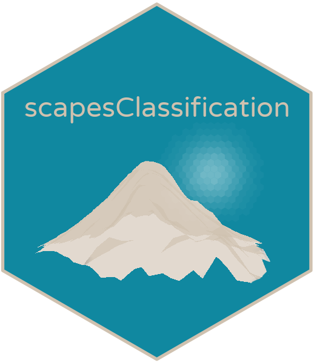

<!-- README.md is generated from README.Rmd. Please edit that file -->

<!-- badges: start -->

[](https://github.com/ghTaranto/scapesClassification/actions)
<!-- badges: end -->

# scapesClassification 

The R-package `scapesClassification` is designed to translate users’
mental models of seascapes, landscapes and, more generally, of
geo-spaces into computer representations (classifications). Spaces and
geographic objects are classified with user-defined rules taking into
account spatial data as well as the spatial relationships existing among
different classes and objects.

## Raster surfaces and objects

  - *scapesClassifications* are performed on raster surfaces. The suit
    of available functions can be used to segment the raster space and
    to identify and manipulate distinct raster objects (i.e., groups of
    raster cells identified by a unique ID).

## Key ideas

  - Landscapes and seascapes tend to have prominent features easy to
    identify. These features can be considered as ***anchor
    locations***, locations around which a classification process can
    start and evolve.

  - A classification process can take into account the ***spatial
    relationships*** that are expected to exist among different classes,
    i.e., where a segment of space or an object is expected to be in
    relation to other segments and objects.

  - Based on such relationships, it is possible to estimate where a
    certain class is expected to exist and to perform ***focal
    evaluations*** of classification rules: rules are only evaluated at
    suitable locations, thus, limiting possible misclassification cases.

  - A classification process is seen as ***multi-step***: as new
    portions of a raster are classified they can be used to define new
    focal areas over which classification rules are evaluated.

## Get started

If you are just getting started with **scapesClassification** and you
would like to have a general overview of the package capabilities you
can consult the [github
page](https://ghtaranto.github.io/scapesClassification/) and the
[working
example](https://ghtaranto.github.io/scapesClassification/articles/get_st.html)
articles. For a deeper understanding of how the package works you can
consult the
[implementation](https://ghtaranto.github.io/scapesClassification/articles/get_st.html)
articles and the examples throughout the package
[documentation](https://ghtaranto.github.io/scapesClassification/reference/index.html).

## Installation

You can install the released version of `scapesClassification` from
[CRAN](https://CRAN.R-project.org) with:

``` r
install.packages("scapesClassification", dependencies = TRUE)
```

And the development version from
[GitHub](https://github.com/ghTaranto/scapesClassification) with:

``` r
# install.packages("devtools")
devtools::install_github("ghTaranto/scapesClassification", dependencies = TRUE)
```
