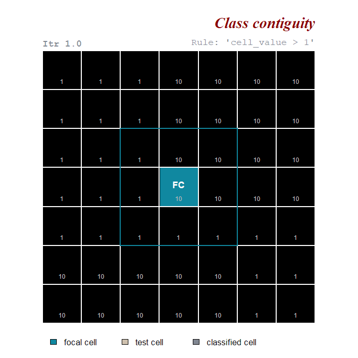
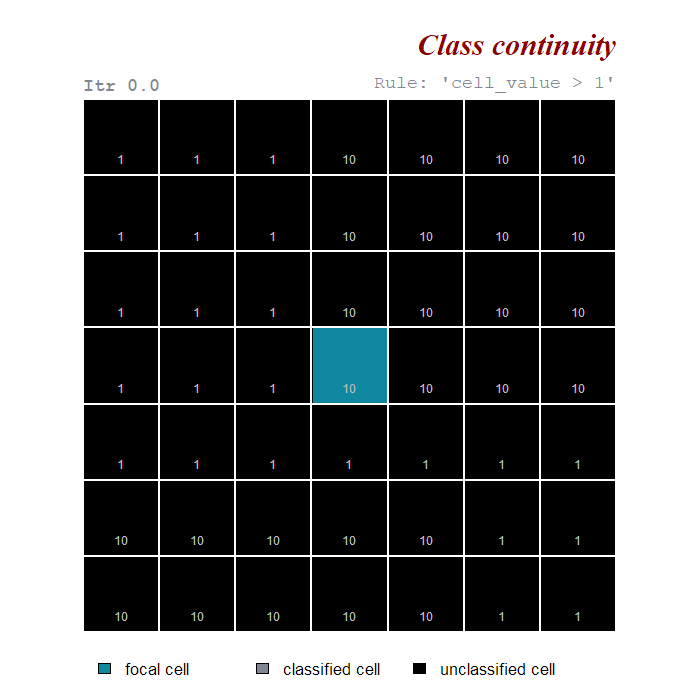

```{r setup, include=FALSE}
knitr::opts_chunk$set(out.width = "70%", echo = TRUE, fig.align='center', message=FALSE, warning=FALSE)
```


## Vectorized evaluation
Classification rules can be evaluated for all raster cells simultaneously. For instance, when we set one or more threshold values (e.g. `cell value > threshold`) or when we evaluate at what locations different spatial objects overlap (e.g., functions `cond.4.all()` and `anchor.svo()`). 

<a id="figure1"></a>

```{r v_eval, message=FALSE, warning=FALSE, echo=FALSE, include=FALSE}
library(gifski)
library(ggplot2)
library(reshape2)

vect_eval <- function(){
  
  m  <- matrix(1,nrow = 7, ncol = 7, byrow = TRUE)
  m[1:4,4:7]  <- 10
  m[6:7, 1:5] <- 10
  
  dta <- t(m)[,nrow(m):1]
  dta <- melt(dta)
  # dta <- dta$value
  # 
  # m     <- matrix(1:49, nrow = 7, ncol = 7, byrow = TRUE)
  # cnumb <- t(m)[,nrow(m):1] 
  # cnumb <- melt(cnumb)
  # cnumb <- cnumb$value
  
  dta$cls[dta$value>1] <- 1
  
  dta$cls <- as.factor(dta$cls)
  dta$value <- as.factor(dta$value)
  dta$blank <- as.factor(NA)
  
  p <- ggplot(dta, aes(x=Var1, y=Var2)) +
    geom_tile(aes(fill=blank), colour="gray90", lwd=1.5, show.legend = FALSE) +
    coord_fixed(ratio=1) + 
    geom_text(aes(label=value), color = "white", family=c("serif"), size=9) + 
    scale_fill_manual(values = c("#1088a0", "goldenrod3"), na.value = "black") + 
    theme_void()
  
  print(p)
  
  p <- ggplot(dta, aes(x=Var1, y=Var2)) +
    geom_tile(aes(fill=cls), colour="gray90", lwd=1.5, show.legend = FALSE) +
    coord_fixed(ratio=1) + 
    geom_text(aes(label=value), color = "white", family=c("serif"), size=9) + 
    scale_fill_manual(values = c("#1088a0", "goldenrod3"), na.value = "black") + 
    theme_void()
  
  print(p)
  
}

gifski::save_gif(vect_eval(), "v_eval.gif", delay = 2.8, width = 800, 
                 height = 800, progress = FALSE, loop = TRUE)
```

```{r gif0, message=FALSE, warning=FALSE, echo=FALSE}
knitr::include_graphics("v_eval.gif")
```

<div style="line-height: 0.8em; margin-bottom: 1.5em;"><span class="legend">**Figure 1 - Vectorized evaluation**. All cells respecting the classification rule `"cell value > 1"` are classified simultaneously.</span></div>

## Focal evaluation
In other cases it can be more fruitful to perform targeted evaluations where classification rules are only tested at specific positions on a raster. These positions can be identified based on their adjacency to particular raster cells that we will call **anchor cells**. Anchor cells can be derived by: previous classifications, environmental or geographic characteristics, local maxima or minima or spatial objects.  

### Class contiguity {#cc}
An example of focal evaluation is when we have some anchor cell and we want to evaluate if its neighboring cells belong to the same class ([Figure 2](#figure2)). 

<a id="figure2"></a>
```{r c_contiguity, message=FALSE, warning=FALSE, echo=FALSE, include=FALSE}
library(gifski)
library(ggplot2)
library(reshape2)

fc_tc <- function(FC){
  
  m  <- matrix(1:49,nrow = 7, ncol = 7, byrow = TRUE)
  # FC <- 25
  
  r   <- raster::raster(m)
  r[] <- NA
  
  FCN <- scapesClassification::nbg8(7,7)[[as.character(FC)]] 
  
  # ORDER PLOTS
  f <- "seagreen"
  r <- "firebrick"
  
  ord <- c(5,8,7,6,4,1,2,3)
  cls <- c(f,f,f,r,r,r,r,r)
  dta <- c(10,10,10,1,1,1,1,1)
  FCN <- FCN[ord]
  
  r   <- raster::raster(m)
  r[] <- NA
  
  r[FCN] <- dta
  
  r_long0 <- melt(raster::as.matrix(r))
  dtaR <- r_long0$value
  
  r[] <- NA
  r[ FC ] <- 0
  r_long <- melt(raster::as.matrix(r))
  r_long$label <- as.character(NA)
  r_long$label[which(r_long$value == 0)] <- "FC"
  r_long$value <- as.factor(r_long$value)
  r_long$dtaR  <- dtaR
  
  p <- ggplot(r_long, aes(x=Var1, y=Var2)) +
    geom_tile(aes(fill=value), colour="gray90", lwd=1.5, show.legend = FALSE) +
    coord_fixed(ratio=1) + 
    geom_text(aes(label=label), color = "white", family=c("serif"), size=9) +
    geom_text(aes(label=dtaR), color = "gray", family=c("serif"), size=5, nudge_y = -0.3) +
    scale_fill_manual(values = c("#1088a0", "goldenrod3"), na.value = "black") + 
    geom_rect(aes(xmin = 2.5, xmax = 5.5, ymin = 2.5, ymax = 5.5), fill = "transparent", color="#1088a0", lwd = 1.5) +
    theme_void()
  
  print(p)
  print(p)
  print(p)
  
  for(i in 1:length(FCN)){
    
    r   <- raster::raster(m)
    r[] <- NA
    
    TC <- FCN[i]
    
    r[ FC ]  <- 0
    r[ TC ]  <- 1
    
    r_long <- melt(raster::as.matrix(r))
    
    r_long$label <- as.character(NA)
    r_long$label[which(r_long$value == 0)] <- "FC"
    r_long$label[which(r_long$value == 1)] <- "TC"
    r_long$value <- as.factor(r_long$value)
    r_long$dtaR  <- dtaR
    
    tc_cord <- r_long[which(r_long$value == 1), c("Var1", "Var2")]
    
    x0 <- tc_cord$Var1 - 1.5
    x1 <- tc_cord$Var1 + 1.5
    y0 <- tc_cord$Var2 - 1.5
    y1 <- tc_cord$Var2 + 1.5
    
    if(i == 1){
      r_long$pts <- "transparent"
    } else {
      r_long$pts <- pts
    }
    
    p <- ggplot(r_long, aes(x=Var1, y=Var2)) +
      geom_tile(aes(fill=value), colour="gray90", lwd=1.5, show.legend = FALSE) +
      coord_fixed(ratio=1) + 
      geom_text(aes(label=label), color = "white", family=c("serif"), size=9) + 
      geom_text(aes(label=dtaR), color = "gray", family=c("serif"), size=5, nudge_y = -0.3) +
      scale_fill_manual(values = c("#1088a0", "goldenrod3"), na.value = "black") + 
      geom_rect(aes(xmin = 2.5, xmax = 5.5, ymin = 2.5, ymax = 5.5), fill = "transparent", color="#1088a0", lwd = 1.5) + 
      geom_rect(aes(xmin = x0, xmax = x1, ymin = y0, ymax = y1), fill = "transparent", color="goldenrod3", lwd = 1.5) + 
      geom_point(aes(x=Var1, y=Var2, color= pts), size = 9) +  scale_colour_identity() +
      theme_void()
    
    print(p)
    
    pts <- r_long$pts
    pts[which(r_long$value==1)] <- cls[i]
  }
  
  r_long$value[which(r_long$value == 1)] <- NA
  r_long$value[which(r_long$pts == f | r_long$value == 0)] <- 1
  
  r_long$pts <- pts
  r_long$label[which(r_long$label == "TC")] <- NA
  
  p <- ggplot(r_long, aes(x=Var1, y=Var2)) +
    geom_tile(aes(fill=value), colour="gray90", lwd=1.5, show.legend = FALSE) +
    coord_fixed(ratio=1) + 
    geom_text(aes(label=label), color = "white", family=c("serif"), size=9) +
    geom_text(aes(label=dtaR), color = "gray", family=c("serif"), size=5, nudge_y = -0.3) +
    scale_fill_manual(values = c("#1088a0", "goldenrod3"), na.value = "black") + 
    geom_rect(aes(xmin = 2.5, xmax = 5.5, ymin = 2.5, ymax = 5.5), fill = "transparent", color="#1088a0", lwd = 1.5) +
    # geom_rect(aes(xmin = x0, xmax = x1, ymin = y0, ymax = y1), fill = "transparent", color="goldenrod3", lwd = 1.5) + 
    geom_point(aes(x=Var1, y=Var2, color= pts), size = 9) +  scale_colour_identity() +
    theme_void()
  
  print(p)
  print(p)
  print(p)
  print(p)
  print(p)
}

gifski::save_gif(fc_tc(25), "fc_tc.gif", delay = 0.8, width = 800, 
                 height = 800, progress = FALSE, loop = TRUE)
```

```{r gif1, message=FALSE, warning=FALSE, echo=FALSE}

```

<div style="line-height: 0.8em; margin-bottom: 1.5em;"><span class="legend">**Figure 2 - Class contiguity evaluation**. Cells adjacent to the **focal cell (FC, in blue)** are being tested. **Test cells (TC, in yellow)** belong to the same class of the focal cell if `"cell value > 1"`. Positive evaluations are showed by a green circle; negative evaluations are showed by a red circle. The blue border indicate the focal cell neighborhood, the yellow border the test cell neighborhood.</span></div>

* **Focal cell.** At turn, each anchor cell is treated as a focal cell. Cells in the neighborhood of a focal cell are considered adjacent to it and are evaluated against the classification rule(s). _In [Figure 2](#figure2) the focal cell is showed in blue and its neighborhood is showed by the blue border._  

* **Test cell.** The cell in the neighborhood of the focal cell that is being tested. _In [Figure 2](#figure2) the test cell is showed in yellow and its neighborhood is showed by the yellow border._  

* **Rule evaluation.** If the classification rule(s) evaluates to true, the test cell is classified, otherwise it is not. _In [Figure 2](#figure2) we considered a dummy classification rule `"cell value > 1"`; positive evaluation are showed by a green circle; negative evaluations are showed by a red circle._ 


### Class discontiguity
A second example of focal evaluation is when we have some anchor cell and we want to evaluate if its neighboring cells belong to a different class ([Figure 3](#figure3)). 

<a id="figure3"></a>
```{r c_discontiguity, message=FALSE, warning=FALSE, echo=FALSE, include=FALSE}
fc_tc <- function(FC){
  
  m  <- matrix(1:49,nrow = 7, ncol = 7, byrow = TRUE)
  # FC <- 25
  
  r   <- raster::raster(m)
  r[] <- NA
  
  FCN <- scapesClassification::nbg8(7,7)[[as.character(FC)]] 
  
  # ORDER PLOTS
  f <- "seagreen"
  r <- "firebrick"
  
  ord <- c(5,8,7,6,4,1,2,3)
  cls <- c(r,r,r,f,f,f,f,f)
  dta <- c(10,10,10,1,1,1,1,1)
  FCN <- FCN[ord]
  
  r   <- raster::raster(m)
  r[] <- NA
  
  r[FCN] <- dta
  
  r_long0 <- melt(raster::as.matrix(r))
  dtaR <- r_long0$value
  
  r[] <- NA
  r[ FC ] <- 0
  r_long <- melt(raster::as.matrix(r))
  r_long$label <- as.character(NA)
  r_long$label[which(r_long$value == 0)] <- "FC"
  r_long$value <- as.factor(r_long$value)
  r_long$dtaR  <- dtaR
  
  p <- ggplot(r_long, aes(x=Var1, y=Var2)) +
    geom_tile(aes(fill=value), colour="gray90", lwd=1.5, show.legend = FALSE) +
    coord_fixed(ratio=1) + 
    geom_text(aes(label=label), color = "white", family=c("serif"), size=9) +
    geom_text(aes(label=dtaR), color = "gray", family=c("serif"), size=5, nudge_y = -0.3) +
    scale_fill_manual(values = c("#1088a0", "goldenrod3"), na.value = "black") + 
    geom_rect(aes(xmin = 2.5, xmax = 5.5, ymin = 2.5, ymax = 5.5), fill = "transparent", color="#1088a0", lwd = 1.5) +
    theme_void()
  
  print(p)
  print(p)
  print(p)
  
  for(i in 1:length(FCN)){
    
    r   <- raster::raster(m)
    r[] <- NA
    
    TC <- FCN[i]
    
    r[ FC ]  <- 0
    r[ TC ]  <- 1
    
    
    r_long <- melt(raster::as.matrix(r))
    
    r_long$label <- as.character(NA)
    r_long$label[which(r_long$value == 0)] <- "FC"
    r_long$label[which(r_long$value == 1)] <- "TC"
    r_long$value <- as.factor(r_long$value)
    r_long$dtaR  <- dtaR
    
    tc_cord <- r_long[which(r_long$value == 1), c("Var1", "Var2")]
    
    x0 <- tc_cord$Var1 - 1.5
    x1 <- tc_cord$Var1 + 1.5
    y0 <- tc_cord$Var2 - 1.5
    y1 <- tc_cord$Var2 + 1.5
    
    if(i == 1){
      r_long$pts <- "transparent"
    } else {
      r_long$pts <- pts
    }
    
    p <- ggplot(r_long, aes(x=Var1, y=Var2)) +
      geom_tile(aes(fill=value), colour="gray90", lwd=1.5, show.legend = FALSE) +
      coord_fixed(ratio=1) + 
      geom_text(aes(label=label), color = "white", family=c("serif"), size=9) + 
      geom_text(aes(label=dtaR), color = "gray", family=c("serif"), size=5, nudge_y = -0.3) +
      scale_fill_manual(values = c("#1088a0", "goldenrod3"), na.value = "black") + 
      geom_rect(aes(xmin = 2.5, xmax = 5.5, ymin = 2.5, ymax = 5.5), fill = "transparent", color="#1088a0", lwd = 1.5) + 
      geom_rect(aes(xmin = x0, xmax = x1, ymin = y0, ymax = y1), fill = "transparent", color="goldenrod3", lwd = 1.5) + 
      geom_point(aes(x=Var1, y=Var2, color= pts), size = 9) +  scale_colour_identity() +
      theme_void()
    
    print(p)
    
    pts <- r_long$pts
    pts[which(r_long$value==1)] <- cls[i]
  }
  
  r_long$pts <- pts
  
  r_long$value[which(r_long$pts == f)] <- 1
  
  r_long$label[which(r_long$label == "TC")] <- NA
  
  p <- ggplot(r_long, aes(x=Var1, y=Var2)) +
    geom_tile(aes(fill=value), colour="gray90", lwd=1.5, show.legend = FALSE) +
    coord_fixed(ratio=1) + 
    geom_text(aes(label=label), color = "white", family=c("serif"), size=9) +
    geom_text(aes(label=dtaR), color = "gray", family=c("serif"), size=5, nudge_y = -0.3) +
    scale_fill_manual(values = c("#1088a0", "goldenrod3"), na.value = "black") + 
    geom_rect(aes(xmin = 2.5, xmax = 5.5, ymin = 2.5, ymax = 5.5), fill = "transparent", color="#1088a0", lwd = 1.5) +
    # geom_rect(aes(xmin = x0, xmax = x1, ymin = y0, ymax = y1), fill = "transparent", color="goldenrod3", lwd = 1.5) + 
    geom_point(aes(x=Var1, y=Var2, color= pts), size = 9) + scale_colour_identity() +
    theme_void()
  
  print(p)
  print(p)
  print(p)
  print(p)
  print(p)
  
}

gifski::save_gif(fc_tc(25), "fc_tc2.gif", delay = 0.8, width = 800, 
                 height = 800, progress = FALSE, loop = TRUE)
```

```{r gif2, message=FALSE, warning=FALSE, echo=FALSE}
knitr::include_graphics("fc_tc2.gif")
```

<div style="line-height: 0.8em; margin-bottom: 1.5em;"><span class="legend">**Figure 3 - Class discontiguity evaluation**. Cells adjacent to the **focal cell (FC, in blue)** are being tested. **Test cells (TC, in yellow)** belong to a user defined class if `"cell value == 1"`. Positive evaluations are showed by a green circle; negative evaluations are showed by a red circle. The blue border indicate the focal cell neighborhood, the yellow border the test cell neighborhood.</span></div>


### Class continuity 

[_Class contiguity_](#cc) evaluates if groups of adjacent cells belong to the same class. As long as **new** cells are classified based on class continuity rule(s), it is possible to find a **new** pool of adjacent cells that can be tested against the same continuity rule(s). This process can be defined as _class continuity_ and can be used to join into the same class cells that share the same property(ies) and that are connected to the same anchor cell(s) ([Figure 4](#figure4)).

<a id="figure4"></a>

```{r c_continuity, message=FALSE, warning=FALSE, echo=FALSE, include=FALSE}
library(scapesClassification)
library(raster)

ccont <- function(FC){
  
  itr <- 0
  
  m  <- matrix(1,nrow = 7, ncol = 7, byrow = TRUE)
  m[1:4,4:7]  <- 10
  m[6:7, 1:5] <- 10
  
  r  <- raster::raster(m)
  nbs<- ngbList(r)
  at <- attTbl(r, "var")
  at$cv[at$Cell == FC] <- 1
  
  dta <- t(m)[,nrow(m):1]
  dta <- melt(dta)
  dta <- dta$value
  
  m     <- matrix(1:49, nrow = 7, ncol = 7, byrow = TRUE)
  cnumb <- t(m)[,nrow(m):1] 
  cnumb <- melt(cnumb)
  cnumb <- cnumb$value
  
  m <- t(m)[,nrow(m):1]
  m_long <- melt(m)
  m_long$dta  <- dta
  m_long$cell <- cnumb
  m_long$cv[m_long$cell == FC] <- 1
  
  m_long$cv <- as.factor(m_long$cv)
  
  m_long$dta[m_long$cell == FC] <- NA
  
  p <- ggplot(m_long, aes(x=Var1, y=Var2)) +
    geom_tile(aes(fill=cv), colour="gray90", lwd=1.5, show.legend = FALSE) +
    coord_fixed(ratio=1) + 
    geom_text(aes(label=dta), color = "white", family=c("serif"), size=9) + 
    scale_fill_manual(values = c("#1088a0", "goldenrod3"), na.value = "black") + 
    theme_void() + 
    labs(subtitle = paste0("Iteration ", itr)) +
    theme(plot.subtitle = element_text(family = "serif", size = 30, color = "grey50", hjust = 0.05, vjust = -3.0))
  
  print(p)
  
  itr <- 1
  continue <- TRUE
  while (continue) {
    
    at$cv <- cond.4.nofn(at, nbs, classVector = at$cv, nbs_of = 1, class = 1, conditions = "var > 1", max.iter = 1)
    cc <- at$Cell[which(at$cv==1)]
    
    m_long$cv[m_long$cell %in% cc] <- 1
    m_long$cv <- as.factor(m_long$cv)
    
    p <- ggplot(m_long, aes(x=Var1, y=Var2)) +
      geom_tile(aes(fill=cv), colour="gray90", lwd=1.5, show.legend = FALSE) +
      coord_fixed(ratio=1) + 
      geom_text(aes(label=dta), color = "white", family=c("serif"), size=9) + 
      scale_fill_manual(values = c("#1088a0", "goldenrod3"), na.value = "black") + 
      theme_void() + 
      labs(subtitle = paste0("Iteration ", itr)) +
      theme(plot.subtitle = element_text(family = "serif", size = 30, color = "grey50", hjust = 0.05, vjust = -3.0))
    
    print(p)
    
    cv_test <- cond.4.nofn(at, nbs, classVector = at$cv, nbs_of = 1, class = 1, conditions = "var > 1", max.iter = 1)
    
    if( sum(cv_test == 1, na.rm = TRUE) == sum(at$cv == 1, na.rm = TRUE) ){
      continue <- FALSE
    }
    itr <- itr + 1
  }
}
  
gifski::save_gif(ccont(25), "ccont.gif", delay = 1.3, width = 800, 
                 height = 800, progress = FALSE, loop = TRUE)
```

```{r gif3, message=FALSE, warning=FALSE, echo=FALSE}

```

<div style="line-height: 0.8em; margin-bottom: 1.5em;"><span class="legend">**Figure 4 - Class continuity.** Every **unclassified cell (in black)** adjacent to **focal cells (in blue)** is being tested. Test cells belong to the same class of the focal cell(s) if `"cell value > 1"`. Note that cells classified in one iteration (`Iteration n`) become focal cells in the next iteration (`Iteration n+1`).</span></div>
