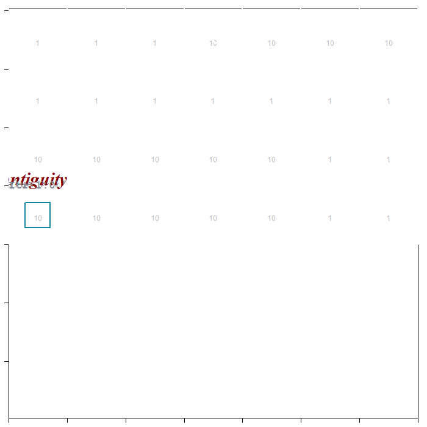
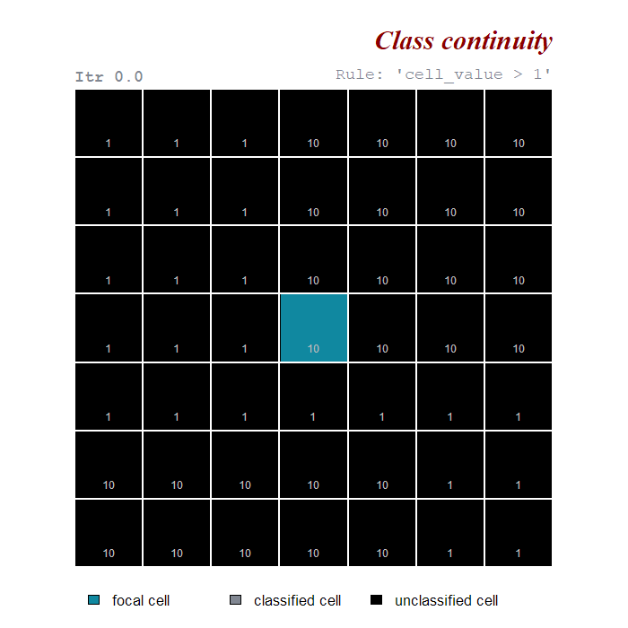

```{r setup, include=FALSE}
knitr::opts_chunk$set(out.width = "90%", echo = TRUE, fig.align='center', message=FALSE, warning=FALSE)
```

## Rule evaluation

One of the differences between `scapesClassification` and other raster classification software is the way classification rules are evaluated. As presented in the next paragraphs, most of the package functions present a focal evaluation of classification rules. 

A second major difference is in the diversity of relative and absolute conditions that `scapesClassification` functions can evaluate.

### Evaluation neighborhood {#en}

`(scapes)Classifications` take into account the spatial relationships existing among distinct groups of cells ([class contiguity and continuity](scapesClassification_01_2_RuleEvaluation.html#focal-evaluation)). The ___evaluation neighborhood___, in which focal evaluations take place, is composed of the following elements ([Figure 1](#figure1)):  

* **Focal cell.** Cell whose neighbors are evaluated against the classification rule(s). 

* **Test cell.** Cell in the neighborhood of the focal cell that is being tested. At turns all cells in the neighborhood of a focal cell are tested against the classification rule(s). 

* **Focal and test cells neighborhoods**. The neighborhoods of focal and test cells (see [cell neighborhoods](scapesClassification_01_1_FormatInputs.html#list-of-neighborhoods)).

* **Directional neighborhood.** The set of cells included both in the focal and in the test cell neighborhoods.

<a id="figure1"></a>

```{r eval_ngb, message=FALSE, warning=FALSE, echo=FALSE}
library(scapesClassification)
library(terra)

# CELL NUMBERS OF A DUMMY RASTER (7X7)
r   <- terra::rast(matrix(1:49, nrow = 7, byrow = TRUE))
nbs <- ngbList(r)

# CLASS VECTOR WITH ONE TEST AND ONE FOCAL CELL
cv <- as.numeric(rep(NA, 49))
cv[c(32, 25)] <- c(2, 1) # tc (class 1), fc (class 2)
r_cv <- cv.2.rast(r, classVector = cv)

# POLYGONS REPRESENTING NEIGHBORHOODS
tcn <- rbind(c(1/7*2, 1/7*5), c(1/7*5, 1/7*5), c(1/7*5, 1/7*2), c(1/7*2, 1/7*2), c(1/7*2, 1/7*5))
tcn <- terra::vect(tcn, type="polygons")

fcn <- rbind(c(1/7*2, 1/7*4), c(1/7*5, 1/7*4), c(1/7*5, 1/7*1), c(1/7*2, 1/7*1), c(1/7*2, 1/7*4))
fcn <- terra::vect(fcn, type="polygons")

# PLOT - FOCAL EVALUATION DEFINITIONS
m<- c(1,1,1,1)
plot(r_cv, type = "class", legend = TRUE, axes = FALSE, ylim=c(-0.15,1.06), mar=m,
     col = c("#1088a0","goldenrod3"), colNA= "black",
     plg=list(x=1, y=1, cex=0.9, legend=c("Focal cell","Test cell")))
text(r, col="white", cex=1.0, family = "sans")
text(x=0, y=1.03, cex=1.5, font=2, adj=0, "Evaluation neighborhood", family = "serif")
lines(r, col="white", lwd=2)
lines(tcn, col="#1088a0", lwd=2)
lines(fcn, col="goldenrod3", lwd=2)
text(x=-0.11, y=-0.03, adj=0, cex=0.9, "Focal cell neighborhood: 17,18,19,24,26,31,32,33", family="mono")
text(x=-0.11, y=-0.08, adj=0, cex=0.9, "Test cell neighborhood: 24,25,26,31,33,38,39,40", family="mono")
text(x=-0.11, y=-0.13, adj=0, cex=0.9, "Directional neighborhood: 24,25,26,31,32,33", family="mono")
```

<div style="line-height: 0.9em; margin-bottom: 1.5em;"><span class="legend">**Figure 1 - Evaluation neighborhood**. Focal cell, test cell and neighborhoods.</span></div>

### Global evaluation
___Global evaluation functions:___ `cond.4.all()`. 

Classification rules are applied to all raster cells regardless of their position on the raster ([Figure 2](#figure2)). Global evaluations are not very common in `scapesClassification`. 

<a id="figure2"></a>

```{r g_eval, message=FALSE, warning=FALSE, echo=FALSE}
library(scapesClassification)
library(terra)

# base rasters 
m  <- matrix(1,nrow = 7, ncol = 7, byrow = TRUE)
m[1:4,4:7]  <- 10
m[6:7, 1:5] <- 10
r <- terra::rast(m)
r_lg <- r; r_lg[] <- 1

#plot
par(mfrow=c(1,2))
m <- c(1, 1, 1.5, 1)

# 1)
plot(r_lg, type="classes", col="black", ylim=c(-0.1,1.16),axes=FALSE, mar=m,
     plg=list(x=0, y=-0.03, cex=0.9, legend="unclassified", ncol=2))
lines(r, col="white", lwd=2)
text(r, col="white", cex=1.0, family = "sans")
text(x=0, y=1.12, cex=1.5, font=2, adj=0, "Global evaluation", family = "serif")
text(x=0, y=1.03, cex=1.1, font=2, adj=0, "a. Raster data", family = "mono", col="#818792")

# 2)
plot(r, type="classes", col=c("black","#1088a0"), ylim=c(-0.1,1.16),axes=FALSE, mar=m,
     plg=list(x=0, y=-0.03, cex=0.9, legend=c("unclassified","classified"), ncol=2))
lines(r, col="white", lwd=2)
text(r, col="white", cex=1.0, family = "sans")
text(x=0, y=1.03, cex=1.1, font=2, adj=0, "b. Rule: 'cell_value > 1'", family = "mono", col="#818792")
```

<div style="line-height: 0.9em; margin-bottom: 1.5em;"><span class="legend">**Figure 2 - Global evaluation**. All raster cells are evaluated against the classification rule. **(a)** Before applying the classification rule; **(b)** after applying the classification rule.</span></div>

### Focal evaluation
___Focal evaluation functions:___ `anchor.seed()`, `cond.4.nofn()`, `cond.reclass()`, `reclass.nbs()` and `classify.all()`. 

Classification rules are only tested at specific positions on a raster. The positions where rules are tested are identified based on their contiguity or continuity to focal cells.

#### Class contiguity {#contiguity}
Classification rules are applied only to raster cells in the [neighborhood](scapesClassification_01_1_FormatInputs.html#list-of-neighborhoods) of focal cells ([Figure 3](#figure3)). 

<a id="figure3"></a>
```{r c_contiguity, message=FALSE, warning=FALSE, echo=FALSE, include=FALSE}
library(gifski)

fc_tc <- function(r, fc=25){
  
  fcn <- rbind(c(1/7*2, 1/7*5), c(1/7*5, 1/7*5), c(1/7*5, 1/7*2), c(1/7*2, 1/7*2), c(1/7*2, 1/7*5))
  fcn <- terra::vect(fcn, type="polygons")
  
  r_lg<-r;r_lg[]<-NA;r_lg[1:3]<-1:3
  l0 <- c("focal cell", "test cell", "classified cell")
  
  m <- c(1, 1, 1, 1)
  r_fc<-r;r_fc[]<-NA;r_fc[25]<-1
  
  plot(r_lg, type="classes", col=c("#1088a0","#cfc1af","#818792"),ylim=c(-0.1,1.16),axes=FALSE,mar=m, 
       plg=list(x=0, y=-0.03, cex=1.4, legend=l0, ncol=3))
  plot(r_fc, type="classes", col="#1088a0",colNA="black", ylim=c(-0.1,1.16),axes=FALSE, mar=m,legend=FALSE, add=TRUE)
  lines(r, col="white", lwd=2)
  lines(fcn, col="#1088a0", lwd=2)
  text(x=xFromCell(r, 1:49), y=yFromCell(r, 1:49)-0.04, col="gray", cex=1, family = "sans", values(r))
  text(x=xFromCell(r, 25),y=yFromCell(r, 25)+0.01,col="white", cex=1.5, font=2,family = "sans", "FC")
  text(x=1, y=1.10, cex=2.5, adj=1, font=4, "Class contiguity", family = "serif", col="darkred")
  text(x=0, y=1.03, cex=1.5, font=2, adj=0, "Itr 1.0", family = "mono", col="#818792")
  text(x=1, y=1.03, cex=1.5, adj=1, "Rule: 'cell_value > 1'", family = "mono", col="#818792")
  
  ngb<-ngb8(7,7)[["25"]]
  ord <- c(2,3,5,8,7,6,4,1,0)
  itr <- 0
  
  for(i in ord){
    
    if(i==2){
      tc0      <- NULL
      col_eval <- NULL
    }
    
    if(i!=2){
      tc0 <- c(tc0, tc)
      col_eval[tc0>1] <-"darkgreen"
      col_eval[tc0<=1]<-"darkred"
    }
    
    r_fc[]<-NA;r_fc[25]<-1
    if(i==0){
      tc<-NULL
      col_r <- "#1088a0"
      itr <- "end"
    }else{
      tc<-ngb[i]
      r_fc[tc]<-2
      col_r <- c("#1088a0","#cfc1af")
      itr <- itr+1
    }
    
    subp <- paste0("Itr 1.", itr)
    
    plot(r_lg, type="classes", col=c("#1088a0","#cfc1af","#818792"),ylim=c(-0.1,1.16),axes=FALSE,mar=m, 
         plg=list(x=0, y=-0.03, cex=1.4, legend=l0, ncol=3))
    plot(r_fc, type="classes", col= col_r, colNA="black",ylim=c(-0.1,1.16),axes=FALSE,mar=m,legend=FALSE, add=TRUE)
    lines(r, col="white", lwd=2)
    lines(fcn, col="#1088a0", lwd=2)
    text(x=xFromCell(r, 1:49), y=yFromCell(r, 1:49)-0.04, col="gray", cex=1, family = "sans", values(r))
    text(x=xFromCell(r, 25),y=yFromCell(r, 25)+0.01,col="white", cex=1.5, font=2,family = "sans", "FC")
    if(!is.null(tc)){
      text(x=xFromCell(r, tc),y=yFromCell(r, tc)+0.01,col="white", cex=1.5, font=2,family = "sans", "TC")
    }
    if(!is.null(tc0)){
      col_eval <- ifelse(unlist(r[tc0]) > 1, "darkgreen", "darkred")
      points(x=xFromCell(r, tc0),y=yFromCell(r, tc0)+0.01, pch=20, col=col_eval, cex=3)
    }
    text(x=1, y=1.10, cex=2.5, adj=1, font=4, "Class contiguity", family = "serif", col="darkred")
    text(x=0, y=1.03, cex=1.5, font=2, adj=0, subp, family = "mono", col="#818792")
    text(x=1, y=1.03, cex=1.5, adj=1, "Rule: 'cell_value > 1'", family = "mono", col="#818792")
  }
  
  fc2 <- tc0[which(col_eval == "darkgreen")]
  r_fc[]<-NA;r_fc[25]<-1
  r_fc[fc2]<-2
  
  col_r <- c("#1088a0","#818792")
  
  for(i in 1:3){
    plot(r_lg, type="classes", col=c("#1088a0","#cfc1af","#818792"),ylim=c(-0.1,1.16),axes=FALSE,mar=m, 
           plg=list(x=0, y=-0.03, cex=1.4, legend=l0, ncol=3))
    plot(r_fc, type="classes", col= col_r,colNA="black", ylim=c(-0.1,1.16),axes=FALSE, mar=m,legend=FALSE, add=TRUE)
    lines(r, col="white", lwd=2)
    lines(fcn, col="#1088a0", lwd=2)
    text(x=xFromCell(r, 1:49), y=yFromCell(r, 1:49)-0.04, col="gray", cex=1, family = "sans", values(r))
    text(x=xFromCell(r, 25),y=yFromCell(r, 25)+0.01,col="white", cex=1.5, font=2,family = "sans", "FC")
    col_eval <- ifelse(unlist(r[tc0]) > 1, "darkgreen", "darkred")
    points(x=xFromCell(r, tc0),y=yFromCell(r, tc0)+0.01, pch=20, col=col_eval, cex=3)
    text(x=1, y=1.10, cex=2.5, adj=1, font=4, "Class contiguity", family = "serif", col="darkred")
    text(x=0, y=1.03, cex=1.5, font=2, adj=0, subp, family = "mono", col="#818792")
    text(x=1, y=1.03, cex=1.5, adj=1, "Rule: 'cell_value > 1'", family = "mono", col="#818792")
  }
}

gifski::save_gif(fc_tc(r), "fc_tc.gif", delay = 0.8, width = 700, 
                 height = 700, progress = FALSE, loop = TRUE)
```

```{r gif1, message=FALSE, warning=FALSE, echo=FALSE, out.width = "80%"}

```

<div style="line-height: 0.9em; margin-bottom: 1.5em;"><span class="legend">**Figure 3 - Class contiguity**. Classification rule applied only to test cells in the neighborhoods of focal cells. Positive evaluations are showed in dark green; negative evaluations in dark red.</span></div>


#### Class continuity {#continuity}

Classification rules are applied to raster cells in the [neighborhood](scapesClassification_01_1_FormatInputs.html#list-of-neighborhoods) of focal cells. Focal cells are updated at each iteration; test cells classified in one iteration become the focal cells of the next iteration. In this way, cells that respect the same rule(s) and that are connected the same focal cells are joined into the same class ([Figure 4](#figure4)).

<a id="figure4"></a>

```{r c_continuity, message=FALSE, warning=FALSE, echo=FALSE, include=FALSE}
ccont <- function(r, fc=25){
  
  r_lg<-r;r_lg[]<-NA;r_lg[1:3]<-1:3
  l0 <- c("focal cell", "classified cell", "unclassified cell")
  
  m <- c(1, 1, 1, 1)
  r_fc<-r;r_fc[]<-NA;r_fc[25]<-1
  
  plot(r_lg, type="classes", col=c("#1088a0","#818792","black"),ylim=c(-0.1,1.16),axes=FALSE,mar=m, 
       plg=list(x=0, y=-0.03, cex=1.4, legend=l0, ncol=3))
  plot(r_fc, type="classes", col="#1088a0",colNA="black", ylim=c(-0.1,1.16),axes=FALSE, mar=m,legend=FALSE, add=TRUE)
  lines(r, col="white", lwd=2)
  # lines(fcn, col="#1088a0", lwd=2)
  text(x=xFromCell(r, 1:49), y=yFromCell(r, 1:49)-0.04, col="gray", cex=1, family = "sans", values(r))
  text(x=1, y=1.10, cex=2.5, adj=1, font=4, "Class continuity", family = "serif", col="darkred")
  text(x=0, y=1.03, cex=1.5, font=2, adj=0, "Itr 0.0", family = "mono", col="#818792")
  text(x=1, y=1.03, cex=1.5, adj=1, "Rule: 'cell_value > 1'", family = "mono", col="#818792")
  
  FC0 <- 25
  FC  <- 25
  tc0 <- NULL
  col_eval <- NULL
  
  itr <- 1
  while (itr<=3) {
    
    tc  <- unlist(ngb8(7,7)[FC])
    tc0 <- unique(c(tc, tc0))
    
    if(25 %in% tc0){
      tc0 <- tc0[-which(tc0==25)]
    }
    
    col_eval <- unlist(r[tc0]) > 1
    
    r_fc<-r;r_fc[]<-NA
    r_fc[tc0[col_eval]] <- 2
    r_fc[FC0]<-1
    col_eval <- ifelse(col_eval, "darkgreen", "darkred")
    
    subp <- paste0("Itr ", itr, ".0")
    
    plot(r_lg, type="classes", col=c("#1088a0","#818792","black"),ylim=c(-0.1,1.16),axes=FALSE,mar=m, 
         plg=list(x=0, y=-0.03, cex=1.4, legend=l0, ncol=3))
    plot(r_fc, type="classes", col=c("#1088a0","#818792"), colNA="black",ylim=c(-0.1,1.16),axes=FALSE,
         mar=m,legend=FALSE, add=TRUE)
    lines(r, col="white", lwd=2)
    # lines(fcn, col="#1088a0", lwd=2)
    text(x=xFromCell(r, 1:49), y=yFromCell(r, 1:49)-0.04, col="gray", cex=1, family = "sans", values(r))
    points(x=xFromCell(r, tc0),y=yFromCell(r, tc0)+0.01, pch=20, col=col_eval, cex=3)
    text(x=1, y=1.10, cex=2.5, adj=1, font=4, "Class continuity", family = "serif", col="darkred")
    text(x=0, y=1.03, cex=1.5, font=2, adj=0, subp, family = "mono", col="#818792")
    text(x=1, y=1.03, cex=1.5, adj=1, "Rule: 'cell_value > 1'", family = "mono", col="#818792")
    
    itr <- itr+1
    
    tc <- tc[unlist(r[tc]) > 1]
    FC  <- tc
    
  }
}
  
gifski::save_gif(ccont(r), "ccont.gif", delay = 1.5, width = 700, 
                 height = 700, progress = FALSE, loop = TRUE)
```

```{r gif3, message=FALSE, warning=FALSE, echo=FALSE, out.width = "80%"}

```

<div style="line-height: 0.9em; margin-bottom: 1.5em;"><span class="legend">**Figure 4 - Class continuity.** Classification rule applied only to test cells in the neighborhoods of focal cells. Test cells classified in one iteration become focal cells in the next iteration. Positive evaluations are showed in dark green; negative evaluations in dark red.</span></div>

## Classification rules {#cr}

In the context of `scapesClassification`, classification rules have the following characteristics: 

* Evaluate either to true or false and determine what raster cells have to be classified;

* Can be absolute (compare cell values against a threshold value) or relative (compare among the values of different cells);

* Can consider any variable included in the attribute table (see `attTbl()` and [format inputs](scapesClassification_01_1_FormatInputs.html)); 

* Variables are accessed by column name;

* Are presented to individual functions in the form of a single character string. 

A detailed explanation about conditions and classification workflow in `scapesClassification` is included in the documentation of the function `?conditions`. 

---

> In the following examples conditions are evaluated based on focal evaluations that consider only class contiguity. 

### Absolute conditions

Absolute conditions compare cell values against a threshold value. There are two types of absolute conditions ([Figure 5](#figure5)):

1. **Absolute test cell condition:** compares test cell values against a threshold value. 

2. **Absolute neighborhood condition:** compares the values of the test cell and of its neighborhood against a threshold value.

    * An absolute neighborhood condition is identified by a variable name followed by curly brackets;

    * A maximum of 9 evaluations are performed for each test cell (threshold value vs. test cell and its 8-neighbors; note that a cell can have less than 8 _valid_ neighbors, [format inputs](scapesClassification_01_1_FormatInputs.html#list-of-neighborhoods));

    * Test cells receive a classification number if the rule is true for at least as many evaluations as the ones specified by the argument `peval` (i.e., positive evaluations).

```{r dummy_data, message=FALSE, warning=FALSE, echo=FALSE}
# DUMMY DATA
################################################################################
library(scapesClassification)
library(terra)

# LOAD THE DUMMY RASTER
r <- list.files(system.file("extdata", package = "scapesClassification"),
                pattern = "dummy_raster\\.tif", full.names = TRUE)
r <- terra::rast(r)

# COMPUTE THE ATTRIBUTE TABLE
at <- attTbl(r, "dummy_var")

# COMPUTE THE LIST OF NEIGBORHOODS
nbs <- ngbList(r)

# TEST CELL
at$cv[at$Cell == 25] <- 0
```

<a id="figure5"></a>

```{r abs_cond, message=FALSE, warning=FALSE, echo=FALSE, out.width="100%"}
# ABSOLUTE TEST CELL CONDITION (do not consider class continuity)
cv1 <- cond.4.nofn(attTbl = at, ngbList = nbs, classVector = at$cv, nbs_of = 0, class = 1,  
                   cond = "dummy_var >= 3")

# ABSOLUTE NEIGHBORHOOD CONDITION (peval = 1)
cv2 <- cond.4.nofn(attTbl = at, ngbList = nbs, classVector = at$cv, nbs_of = c(0), class = 1,
                   cond = "dummy_var{} >= 3",
                   peval = 8/9)

# CONVERT THE CLASS VECTORS INTO A RASTER
r_cv1 <- cv.2.rast(r, classVector = cv1)
r_cv2 <- cv.2.rast(r, classVector = cv2)

# CONVERT NA VALUES INTO A CLASS
r_cv1[which(is.na(cv1))] <- 10
r_cv2[which(is.na(cv2))] <- 10

# FOCAL CELL NEIGHBORHOOD
fcn <- rbind(c(1/7*2, 1/7*5), c(1/7*5, 1/7*5), c(1/7*5, 1/7*2), c(1/7*2, 1/7*2), c(1/7*2, 1/7*5))
fcn <- terra::vect(fcn, type="polygons")

# EVALUATIONS
p1_nbs <- ngb8(7,7)[[25]]
col_eval_p1 <- ifelse(unlist(r[p1_nbs]) >= 3, "darkgreen", "darkred")

p2_nbs <- ngb8(7,7)[[25]]
p2_nbs <- unique(unlist(ngb8(7,7)[p2_nbs]))
col_eval_p2 <- ifelse(unlist(r[p2_nbs]) >= 3, "darkgreen", "darkred")

par(mfrow=c(1,2))
m <- c(0.5,1,0.5,1)
# PLOT 1
##########################################################################


plot(r_cv1, type = "class", axes = FALSE, ylim=c(-0.05,1.16), mar=m,
     col = c("#1088a0","#cfad89","black"), colNA= "black",
     plg=list(x=0, y=-0.01, cex=0.8, ncol=3, title = "Cell:", title.adj = 0,
              legend=c("focal","classified", "unclassified")))
text(r, col="white", cex=1.0, family = "sans")
lines(r, col="white", lwd=2)
lines(fcn, col="#1088a0", lwd=2)
text(x=0, y=1.16, cex=1.4, font=2, adj=0, "(a) Abs. test cell condition", family = "serif")
text(x=0, y=1.08, cex=0.8, font=2, adj=0, "Cond.: 'dummy_var >= 3'", family = "mono", col="#818792")
text(x=0, y=1.03, cex=0.8, font=2, adj=0, "peval = NA", family = "mono", col="#818792")
points(x=xFromCell(r, p1_nbs),y=yFromCell(r, p1_nbs)-0.045, pch=20, col=col_eval_p1, cex=1)

# PLOT 2
##########################################################################
plot(r_cv2, type = "class", axes = FALSE, ylim=c(-0.04,1.14), mar=m,
     col = c("#1088a0","#cfad89","black"), colNA= "black",
     plg=list(x=0, y=-0.01, cex=0.8, ncol=3, title = "Cell:", title.adj = 0,
              legend=c("focal","classified", "unclassified")))
text(r, col="white", cex=1.0, family = "sans")
lines(r, col="white", lwd=2)
lines(fcn, col="#1088a0", lwd=2)
text(x=0, y=1.16, cex=1.4, font=2, adj=0, "(b) Abs. neighborhood condition", family = "serif")
text(x=0, y=1.08, cex=0.8, font=2, adj=0, "Cond.: 'dummy_var{} >= 3'", family = "mono", col="#818792")
text(x=0, y=1.03, cex=0.8, font=2, adj=0, "peval = 8/9", family = "mono", col="#818792")
points(x=xFromCell(r, p2_nbs),y=yFromCell(r, p2_nbs)-0.045, pch=20, col=col_eval_p2, cex=1)
##########################################################################
```

<div style="line-height: 0.9em; margin-bottom: 1.5em;"><span class="legend">**Figure 5 - Absolute condition.** (a) Test cells are classified if their value `>=3`. (b) Test cells are classified if among the values of the test cell and of the test cell neighborhood at least 8/9 (`peval = 8/9`) are `>=3`. Test cells are cells in the focal cell neighborhood (blue line). Positive evaluations are showed in dark green, negative evaluations in dark red.</span></div>

### Relative conditions

Relative conditions compare among the values of different cells. There are two types of relative conditions ([Figure 6](#figure6)):

1. **Relative focal cell condition:** compares the test cell value against the focal cell value.

    * A relative focal cell condition is identified by a variable name followed by square brackets;
    
    * The variable name is repeated twice, once with square brackets and once without. Square brackets indicate the focal cell value.

2. **Relative neighborhood condition:** compares the values of the test cell against the values of the test cell neighborhood.

    * A relative neighborhood condition is identified by a variable name followed by curly brackets;
    
    * The variable name is repeated twice, once with curly brackets and once without. Curly brackets indicate the test cell neighborhood.

    * A maximum of 8 evaluations are performed for each test cell (test cell vs. 8 neighbors; note that a cell can have less than 8 _valid_ neighbors, [format inputs](scapesClassification_01_1_FormatInputs.html#list-of-neighborhoods));

    * Test cells receive a classification number if the rule is true for at least as many evaluations as the ones specified by the argument `peval` (i.e., positive evaluations).

<a id="figure6"></a>

```{r rel_cond, message=FALSE, warning=FALSE, echo=FALSE, out.width="100%"}
# ABSOLUTE TEST CELL CONDITION (do not consider class continuity)
cv1 <- cond.4.nofn(attTbl = at, ngbList = nbs, classVector = at$cv, nbs_of = 0, class = 1,  
                   cond = "abs(dummy_var[]-dummy_var) < 2")

# ABSOLUTE NEIGHBORHOOD CONDITION (peval = 1)
cv2 <- cond.4.nofn(attTbl = at, ngbList = nbs, classVector = at$cv, nbs_of = c(0), class = 1,
                   cond = "abs(dummy_var{}-dummy_var) < 2",
                   peval = 7/8)

# CONVERT THE CLASS VECTORS INTO A RASTER
r_cv1 <- cv.2.rast(r, classVector = cv1)
r_cv2 <- cv.2.rast(r, classVector = cv2)

# CONVERT NA VALUES INTO A CLASS
r_cv1[which(is.na(cv1))] <- 10
r_cv2[which(is.na(cv2))] <- 10

# FOCAL CELL NEIGHBORHOOD
fcn <- rbind(c(1/7*2, 1/7*5), c(1/7*5, 1/7*5), c(1/7*5, 1/7*2), c(1/7*2, 1/7*2), c(1/7*2, 1/7*5))
fcn <- terra::vect(fcn, type="polygons")

# EVALUATIONS
p1_nbs <- ngb8(7,7)[[25]]
col_eval_p1 <- ifelse( abs(unlist(r[p1_nbs])-3) < 2, "darkgreen", "darkred")

p2_nbs <- ngb8(7,7)[[31]]
col_eval_p2 <- ifelse( abs(unlist(r[p2_nbs])-2) < 2, "darkgreen", "darkred")


par(mfrow=c(1,2))
m <- c(0.5,1,0.5,1)
# PLOT 1
##########################################################################


plot(r_cv1, type = "class", axes = FALSE, ylim=c(-0.05,1.16), mar=m,
     col = c("#1088a0","#cfad89","black"), colNA= "black",
     plg=list(x=0, y=-0.01, cex=0.8, ncol=3, title = "Cell:", title.adj = 0,
              legend=c("focal","classified", "unclassified")))
text(r, col="white", cex=1.0, family = "sans")
lines(r, col="white", lwd=2)
lines(fcn, col="#1088a0", lwd=2)
text(x=0, y=1.16, cex=1.4, font=2, adj=0, "(a) Rel. focal cell condition", family = "serif")
text(x=0, y=1.08, cex=0.8, font=2, adj=0, "Cond.: 'abs(dummy_var[]-dummy_var)<2'", family = "mono", col="#818792")
text(x=0, y=1.03, cex=0.8, font=2, adj=0, "peval = NA", family = "mono", col="#818792")
points(x=xFromCell(r, p1_nbs),y=yFromCell(r, p1_nbs)-0.045, pch=20, col=col_eval_p1, cex=1)

# PLOT 2
##########################################################################
plot(r_cv2, type = "class", axes = FALSE, ylim=c(-0.04,1.14), mar=m,
     col = c("#1088a0","#cfad89","black"), colNA= "black",
     plg=list(x=0, y=-0.01, cex=0.8, ncol=3, title = "Cell:", title.adj = 0,
              legend=c("focal","classified", "unclassified")))
text(r, col="white", cex=1.0, family = "sans")
lines(r, col="white", lwd=2)
lines(fcn, col="#1088a0", lwd=2)
text(x=0, y=1.16, cex=1.4, font=2, adj=0, "(b) Rel. neighborhood condition", family = "serif")
text(x=0, y=1.08, cex=0.8, font=2, adj=0, "Cond.: 'abs(dummy_var{}-dummy_var)<2'", family = "mono", col="#818792")
text(x=0, y=1.03, cex=0.8, font=2, adj=0, "peval = 7/8", family = "mono", col="#818792")
points(x=xFromCell(r, p2_nbs),y=yFromCell(r, p2_nbs)-0.045, pch=20, col=col_eval_p2, cex=1)
##########################################################################
```

<div style="line-height: 0.9em; margin-bottom: 1.5em;"><span class="legend">**Figure 6 - Relative condition.** (a) Test cells are classified if the absolute difference between test and focal cells is `<2`. (b) Test cells are classified if at least 7 absolute differences between a test cell and the cells in its neighborhood are `<2` (`peval = 7/8`). Test cells are cells in the focal cell neighborhood (blue line). Positive evaluations are showed in dark green, negative evaluations in dark red. In (b) are showed only the evaluation of the classified test cell.</span></div>
