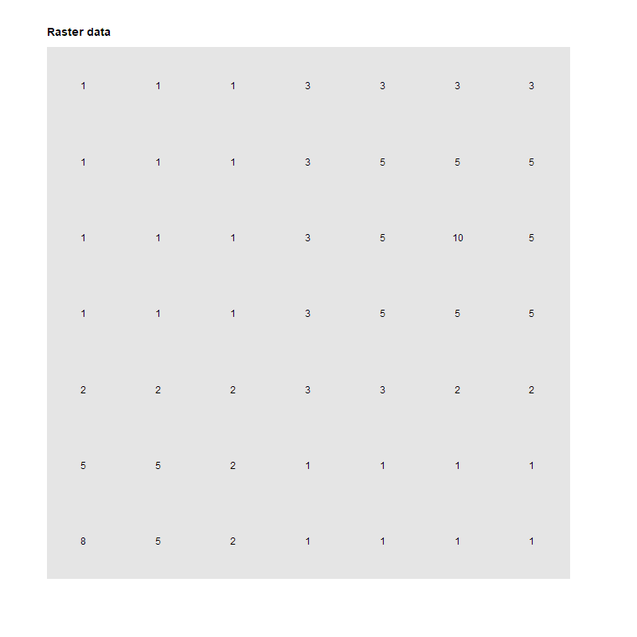

```{r setup, include=FALSE}
knitr::opts_chunk$set(echo = TRUE, fig.align='center', message=FALSE, warning=FALSE, out.width = "100%")
```

The function `anchor.seed()` can be both used to (i) identify anchor cells at local maxima or minima or (ii) to identify raster objects. In the next sections we will illustrate how it can be used. 

## Dummy raster

We will use a dummy raster to illustrate the function `anchor.seed()` ([Figure 1](#figure1)). We can start by computing its [attribute table](scapesClassification_01_1_FormatInputs.html#attribute-table), in which it is named `"dummy_var"`, and its [list of neighborhoods](scapesClassification_01_1_FormatInputs.html#list-of-neighborhoods).

```{r def, message=FALSE, warning=FALSE, echo=TRUE}
# LOAD LIBRARIES
library(scapesClassification)
library(raster)

# LOAD THE DUMMY RASTER
r <- list.files(system.file("extdata", package = "scapesClassification"), 
                 pattern = "dummy_raster\\.tif", full.names = TRUE)
r <- raster(r)
```

```{r def_at, message=FALSE, warning=FALSE, echo=TRUE, collapse=TRUE}
# COMPUTE THE ATTRIBUTE TABLE
at <- attTbl(r, "dummy_var")

head(at, 8)

# COMPUTE THE LIST OF NEIGBORHOODS
nbs <- ngbList(r)

head(nbs, 3)
```

<a id="figure1"></a>

```{r dummy_rast_plot, message=FALSE, warning=FALSE, echo=TRUE}
# PLOT RASTER
par(mar = c(0.1, 5, 0.5, 0.1))
plot(r, axes=FALSE, box=FALSE, legend = FALSE, col = "grey90")
text(r)
```

<div style="line-height: 0.8em; margin-bottom: 1.5em;"><span class="legend">**Figure 1 -** Dummy raster used to illustrate `scapesClassification` functions.</span></div>

## Condition arguments

The function `anchor.seed()` take as inputs four sets of conditions:

1. **`cond.filter`**, the conditions to define what cells have to be evaluated by the function. 

2. **`cond.seed`**, the conditions to identify, at each iteration, the _seed cell_. The seed cell is the cell around which growth and isolation conditions are applied.

3. **`cond.growth`**, the conditions to define a buffer around the _seed cell_.

4. **`cond.isol`**, the conditions to isolate one seed cell (and its buffer) from another. 


## Condition evaluation

The first set of condition to be evaluated is the `cond.filter`. The evaluation of the remaining sets of conditions is iterative and take into account [class continuity](scapesClassification_01_2_RuleEvaluation.html#focal-evaluation). At each iteration the following process is repeated ([Figure 2](#figure2)): 

* A _seed cell_ is identified and receives a classification number (as specified by the argument `class`)

* Cells continuous to the seed cell meeting the conditions specified by `cond.growth` are assigned to the same class of the seed cell. We can call these cells `growth cells`. 

* Cells continuous to the `growth cells` meeting the conditions specified by `cond.isol` are assigned to an _isolation buffer_ (class = -1). 

* Once seed, growth and isolation cells are identified, they are ignored in all following iterations.

## Relative conditions - Lag

The function arguments `lag.growth` and `lag.isol` 

## Find local maxima

As an example we will identify the two local maxima existin on the dummy raster can find local using the following set of conditions [Figure 2](#figure2): 

* `cond.filter = "dummy_var > 2"`

* `cond.sed = "dummy_var == max(dummy_var)"`

* `cond.growth = NULL`

* `cond.isol = dummy_var < dummy_var[]`

```{r seed_eval_gif, message=FALSE, warning=FALSE, echo=FALSE, include=FALSE}
library(gifski)

gif_seed <- function(){
 
  cond.filter = "dummy_var > 2"
  cond.sed    = "dummy_var == max(dummy_var)"
  cond.isol   = "dummy_var < dummy_var[]"
  
  #CONDITION FILTER
  at$cf  <- cond.4.all(at, conditions = "dummy_var > 2", class = 1)
  
  #ITERATION 1
  cs1 <- cond.4.all(at, conditions = "dummy_var == 10", class = 1)
  ci1 <- cond.4.nofn(at, nbs, 
                     classVector = cs1,
                     nbs_of = c(1, -1),
                     conditions = "dummy_var < dummy_var[] & !is.na(cf)", 
                     class = -1)
  
  #ITERATION 2
  cs2 <- cond.4.all(at, classVector = ci1, 
                    conditions = "dummy_var == 8 & !is.na(cf)", 
                    class = 1)
  
  ci2 <- cond.4.nofn(at, nbs, 
                     classVector = cs2,
                     nbs_of = c(1, -1),
                     conditions = "dummy_var < dummy_var[] & !is.na(cf)", 
                     class = -1)
  
  #CLASS VECTORS TO RASTERS
  r_cf <- cv.2.rast(r, at$Cell,classVector = at$cf)
  
  r_cs1 <- cv.2.rast(r, at$Cell,classVector = cs1)
  r_ci1 <- cv.2.rast(r, at$Cell,classVector = ci1)
  
  r_cs2 <- cv.2.rast(r, at$Cell,classVector = cs2)
  r_ci2 <- cv.2.rast(r, at$Cell,classVector = ci2)
  
  # PLOTS #####################################################################
  
  #RASTER DATA
  plot(r, axes=FALSE, box=FALSE, legend = FALSE, asp = NA, colNA = "grey90",
       col="grey90")
  text(r)
  title("Raster data", adj = 0.0, line = 1)
  
  # ITERATION 0
  plot(r_cf, axes=FALSE, box=FALSE, legend = FALSE, asp = NA, colNA = "grey90",
       col="#78b2c4")
  text(r)
  title("Iteration: 0.0, COND.FILTER", adj = 0.0, line = 1)
  legend("topleft", bg = "white", legend = "Valid cell", fill = "#78b2c4")
  
  # ITERATION 1
  # 1.1
  plot(r_cf, axes=FALSE, box=FALSE, legend = FALSE, asp = NA, colNA = "grey90",
       col="#78b2c4")
  plot(r_cs1, axes=FALSE, box=FALSE, legend = FALSE, asp = NA,
       col="#98fb98", add = TRUE)
  text(r)
  title("Iteration: 1.1, COND.SEED", adj = 0.0, line = 1)
  legend("topleft", bg = "white", legend = "Seed cell", fill = "#98fb98")
  
  # 1.2 
  plot(r_cf, axes=FALSE, box=FALSE, legend = FALSE, asp = NA, colNA = "grey90",
       col="#78b2c4")
  plot(r_ci1, axes=FALSE, box=FALSE, legend = FALSE, asp = NA,
       col=c("#d76968","#98fb98"), add = TRUE)
  text(r)
  title("Iteration: 1.2, COND.ISOL", adj = 0.0, line = 1)
  legend("topleft", bg = "white", legend = "Isolation cell", fill = "#d76968")
  
  # ITERATION 2
  # 2.1
  plot(r_cf, axes=FALSE, box=FALSE, legend = FALSE, asp = NA, colNA = "grey90",
       col="#78b2c4")
  plot(r_cs2, axes=FALSE, box=FALSE, legend = FALSE, asp = NA,
       col=c("#d76968","#98fb98"), add = TRUE)
  text(r)
  title("Iteration: 2.1, COND.SEED", adj = 0.0, line = 1)
  legend("topleft", bg = "white", legend = "Seed cell", fill = "#98fb98")
  
  # 2.2 
  plot(r_cf, axes=FALSE, box=FALSE, legend = FALSE, asp = NA, colNA = "grey90",
       col="#78b2c4")
  plot(r_ci2, axes=FALSE, box=FALSE, legend = FALSE, asp = NA,
       col=c("#d76968","#98fb98"), add = TRUE)
  text(r)
  title("Iteration: 2.2, COND.ISOL", adj = 0.0, line = 1)
  legend("topleft", bg = "white", legend = "Isolation cell", fill = "#d76968")
   
}

gifski::save_gif(gif_seed(), "gif_seed.gif", delay = 3, width = 800, 
                 height = 800, progress = FALSE, loop = TRUE)
```

<a id="figure2"></a>

```{r add_gif, message=FALSE, warning=FALSE, echo=FALSE}

```

---

```{r anc_seed1, message=FALSE, warning=FALSE, echo=TRUE, collapse=TRUE}
# ATTRIBUTE TABLE VARIABLES
names(at)

# COMPUTE THE CLASS VECTOR
cv <- anchor.seed(at,
                  nbs,
                  
                  class = 1,
                  
                  cond.filter = "dummy_var > 2",
                  
                  cond.seed = "dummy_var == max(dummy_var)",
                  
                  cond.isol = "dummy_var < dummy_var[]",
                  
                  lag.isol = 1, 
                  
                  isolationClass = TRUE, 
                  
                  silent = TRUE)


# CONVERT THE CLASS VECTOR INTO A RASTER
r_cv <- cv.2.rast(r, at$Cell, classVector = cv)
```

<a id="figure2"></a>
```{r anc_seed1_plot, message=FALSE, warning=FALSE, echo=TRUE, collapse=TRUE}
# CLASS VECTOR LEVELS
unique(cv)

# class = 1,  peaks
# class = -1, isolation class
# class = NA, unclassified cells

# PLOT THE CLASS VECTOR
par(mar = c(0.1, 0.1, 0.1, 0.1), par(mfrow=c(1,2)))
plot(r, axes=FALSE, box=FALSE, legend = FALSE, col=c("grey"))
text(r)

plot(r_cv, axes=FALSE, box=FALSE, legend = FALSE, colNA="#818792", col=c("#1088a0", "#cfad89"))
text(r_cv)
```

<div style="line-height: 0.8em; margin-bottom: 1.5em;"><span class="legend">**Figure 2 -** Find local maxima using the function **anchor.seed**. **On the left** dummy raster. **On the right** classified cells. In **brown**, local peaks; in **blue** cells meeting isolation conditions; in **grey** cells not meeting filter condition (unclassified cells).</span></div>

## Find raster objects

```{r anc_seed2, message=FALSE, warning=FALSE, echo=TRUE, collapse=TRUE}
# ATTRIBUTE TABLE VARIABLES
names(at)

# COMPUTE THE CLASS VECTOR
cv <- anchor.seed(at,
                  nbs,
                  
                  class = NULL,
                  
                  cond.filter = "dummy_var > 2",
                  
                  cond.seed = "dummy_var == max(dummy_var)",
                  
                  cond.growth = "dummy_var < dummy_var[]",
                  
                  lag.growth = 1,
                  
                  lag.isol = 1, 
                  
                  isolationClass = TRUE)

# CONVERT THE CLASS VECTOR INTO A RASTER
r_cv <- cv.2.rast(r, at$Cell, classVector = cv)
```

```{r anc_seed2_plot, message=FALSE, warning=FALSE, echo=TRUE, collapse=TRUE}
# CLASS VECTOR LEVELS
unique(cv)

# class = 1,  peaks
# class = -1, isolation class
# class = NA, unclassified cells

# PLOT THE CLASS VECTOR
par(mar = c(0.1, 0.1, 0.1, 0.1), par(mfrow=c(1,2)))
plot(r, axes=FALSE, box=FALSE, legend = FALSE, col=c("grey"))
text(r)

plot(r_cv, axes=FALSE, box=FALSE, legend = FALSE, colNA="#818792", col=c("#1088a0", "#cfad89"))
text(r_cv)
```
